# Apache Spark Mutual Friends Analysis

## Overview

This project demonstrates how to find mutual friends between users using Apache Spark's Resilient Distributed Datasets (RDDs). The application analyzes social network data to identify common connections between users.

## What is Apache Spark?

Apache Spark is a unified analytics engine for large-scale data processing. It provides high-level APIs in Java, Scala, Python, and R, and an optimized engine that supports general execution graphs.

### Key Spark Concepts

#### Resilient Distributed Datasets (RDDs)
- **Fault-tolerant**: Automatically recovers from node failures
- **Immutable**: Cannot be changed once created
- **Distributed**: Data is spread across multiple nodes
- **Lazy evaluation**: Operations are not executed until an action is called

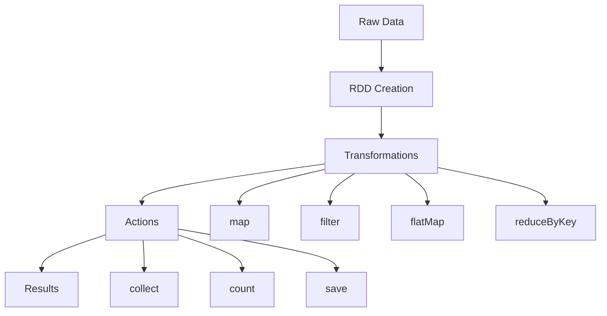

## Project Architecture

### Data Flow Diagram

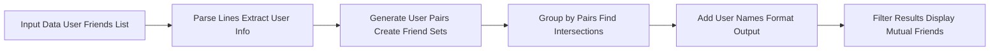

### Spark Application Structure

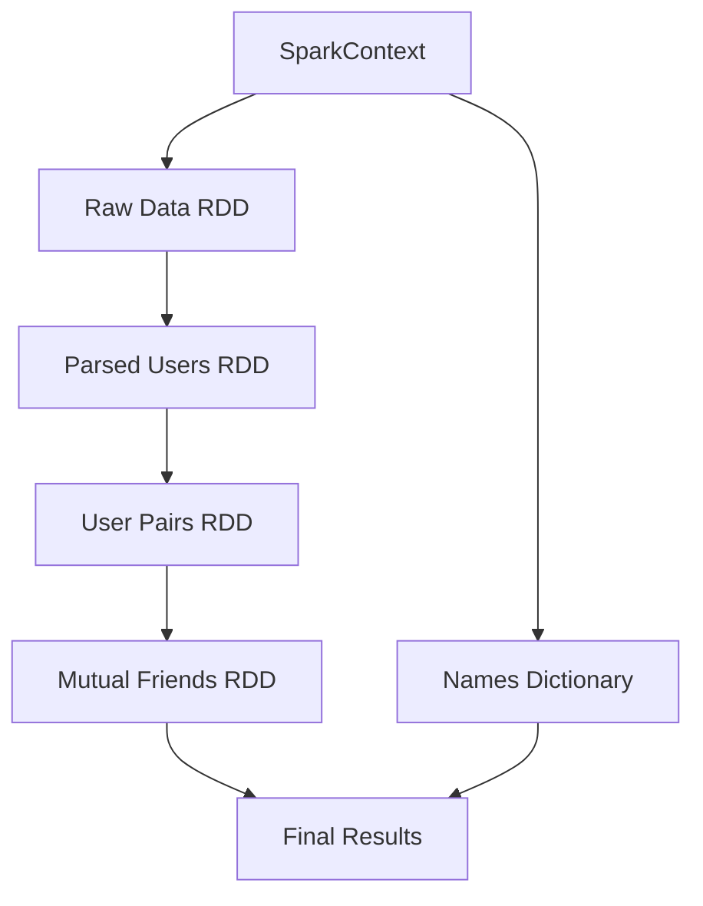

## Code Breakdown

### 1. SparkContext Initialization

```python
from pyspark import SparkContext
sc = SparkContext("local", "MutualFriendsApp")
```

**Purpose**: Creates the entry point to Spark functionality
- `"local"`: Runs Spark locally on all available cores
- `"MutualFriendsApp"`: Application name for monitoring

### 2. Data Preparation

```python
data = [
    "1 Sidi 2,3,4",
    "2 Mohamed 1,3,5,4", 
    "3 Ahmed 1,2,4,5",
    "4 Mariam 1,3",
    "5 Zainab 2,3"
]
rdd = sc.parallelize(data)
```

**Data Format**: `user_id name friend_id1,friend_id2,friend_id3`

#### Social Network Visualization

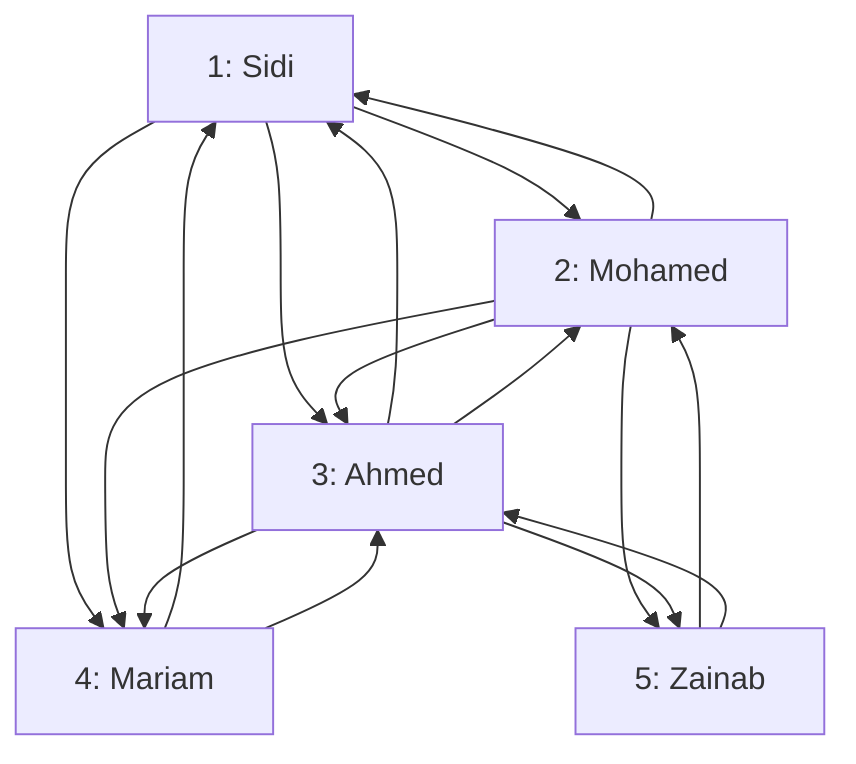

### 3. Data Parsing

```python
def parse_line(line):
    parts = line.strip().split()
    user_id = int(parts[0])
    name = parts[1]
    friends = list(map(int, parts[2].split(',')))
    return (user_id, name, friends)

users_rdd = rdd.map(parse_line)
```

**Transformation**: Raw strings → Structured tuples `(user_id, name, [friends])`

#### Parsing Flow

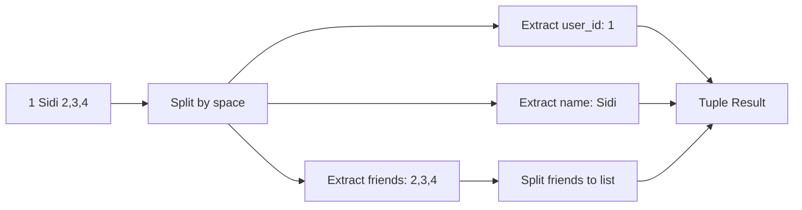

### 4. Pair Generation

```python
def generate_pairs(user_id, friends):
    return [((min(user_id, friend), max(user_id, friend)), set(friends)) 
            for friend in friends]

pairs_rdd = users_rdd.flatMap(lambda x: generate_pairs(x[0], x[2]))
```

**Purpose**: Creates user pairs with their respective friend sets
- `min/max`: Ensures consistent pair ordering (1,2) instead of (2,1)

#### Pair Generation Example

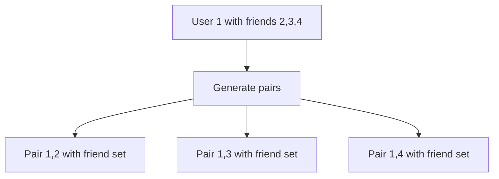

### 5. Finding Mutual Friends

```python
mutual_friends = pairs_rdd.reduceByKey(lambda x, y: x & y)
```

**Operation**: Groups pairs and finds set intersection using `&` operator

#### Mutual Friends Calculation

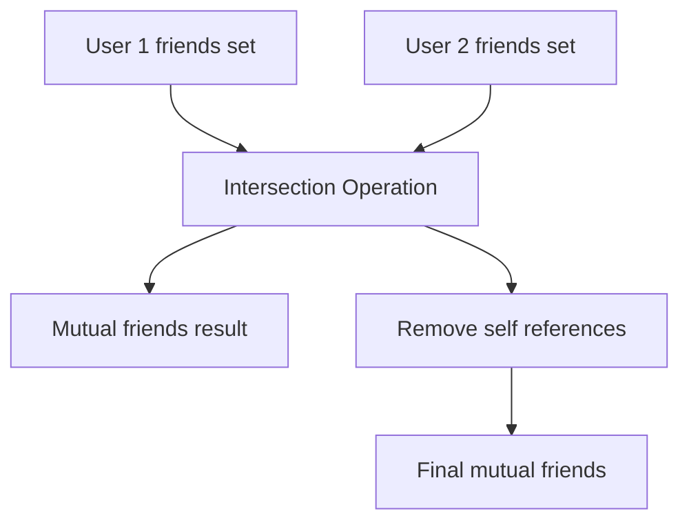

### 6. Name Resolution

```python
names_dict = users_rdd.map(lambda x: (x[0], x[1])).collectAsMap()
```

**Purpose**: Creates a lookup dictionary for user ID to name mapping

#### Dictionary Structure

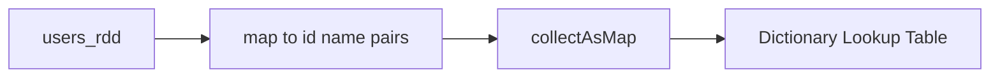

### 7. Result Filtering and Display

```python
result = mutual_friends.filter(lambda x: x[0] == (1, 2)).collect()

for pair, mutual in result:
    id1, id2 = pair
    nom1, nom2 = names_dict[id1], names_dict[id2]
    mutual_names = [names_dict[friend_id] for friend_id in mutual]
    print(f"{id1}<{nom1}>{id2}<{nom2}> => Amis communs: {mutual_names}")
```

## Spark Operations Used

### Transformations (Lazy)
- **`map()`**: Transforms each element
- **`flatMap()`**: Transforms and flattens results
- **`filter()`**: Keeps elements matching condition
- **`reduceByKey()`**: Combines values for same key

### Actions (Eager)
- **`collect()`**: Returns all elements to driver
- **`collectAsMap()`**: Returns key-value pairs as dictionary

## Performance Characteristics

### RDD Lineage Graph

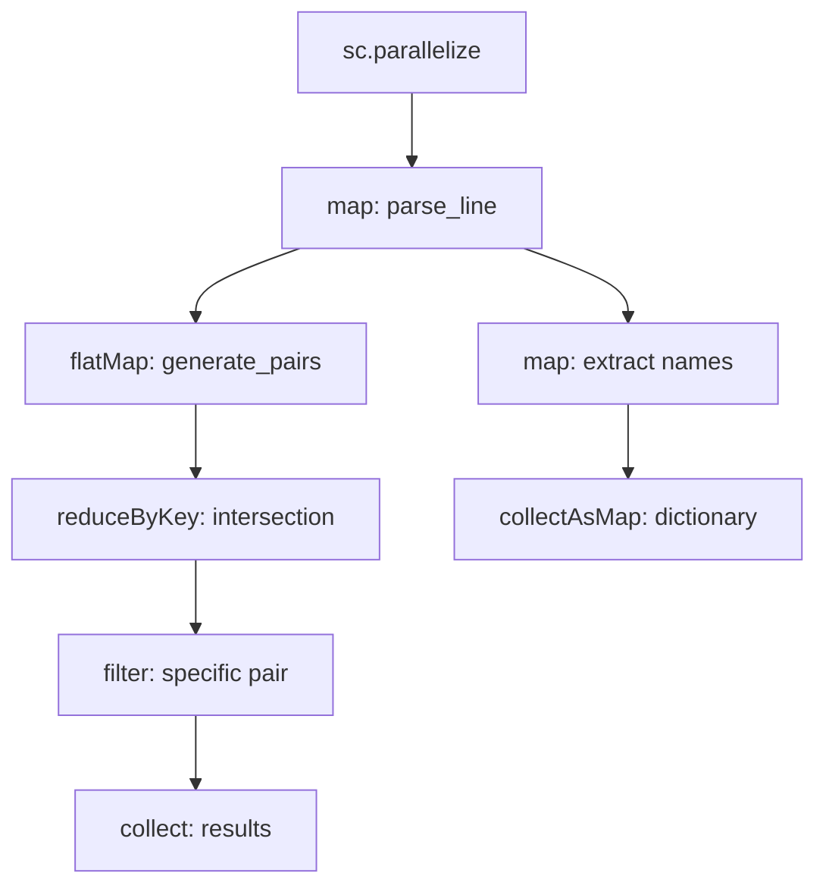

### Execution Plan

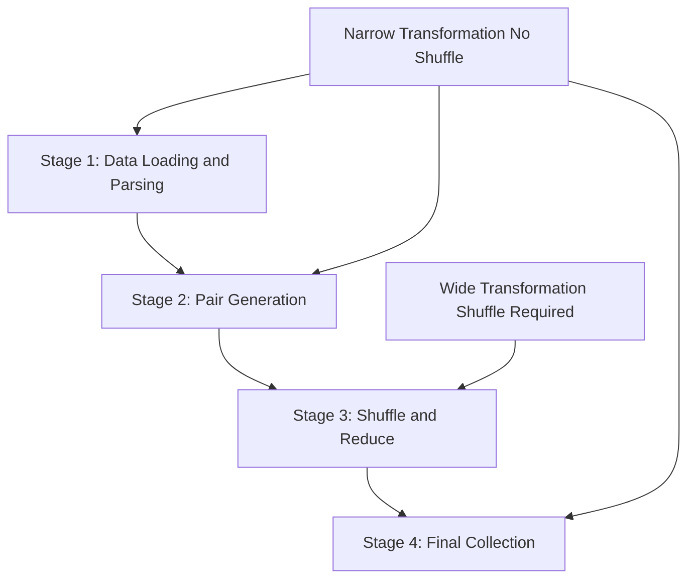

## Example Output

For the given data, when finding mutual friends between users 1 (Sidi) and 2 (Mohamed):

```
1<Sidi>2<Mohamed> => Amis communs: ['Ahmed', 'Mariam']
```

### Complete Mutual Friends Matrix

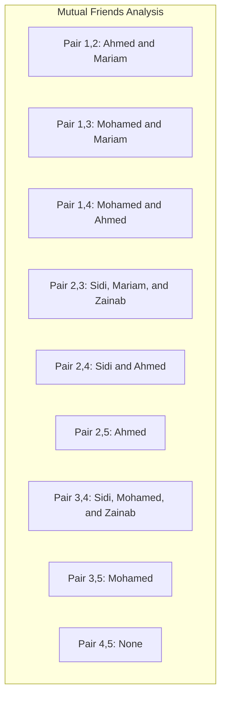

## Optimization Strategies

### 1. Partitioning
```python
# Partition data for better performance
pairs_rdd = pairs_rdd.partitionBy(numPartitions=4)
```

### 2. Caching
```python
# Cache frequently accessed RDDs
users_rdd.cache()
mutual_friends.cache()
```

### 3. Broadcast Variables
```python
# For large lookup dictionaries
broadcast_names = sc.broadcast(names_dict)
```

## Scaling Considerations

### Data Size Impact

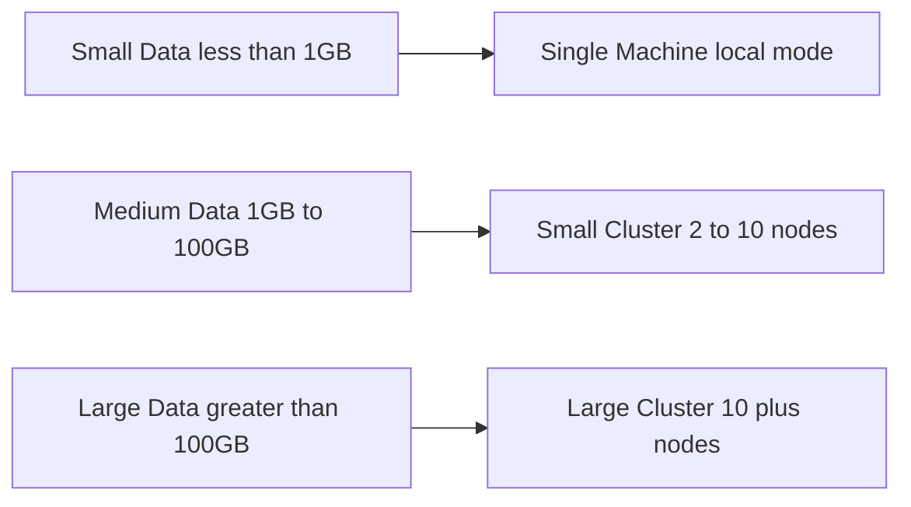

### Memory Management

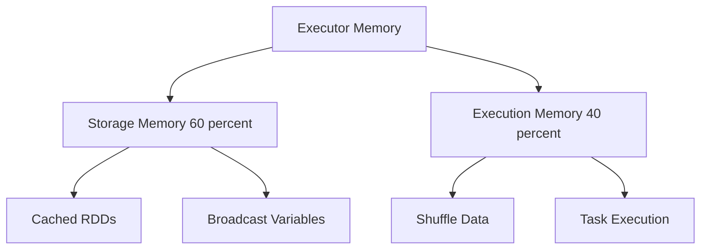

## Error Handling

### Common Issues
1. **OutOfMemoryError**: Increase executor memory or reduce data size
2. **Serialization errors**: Ensure all functions are serializable
3. **File not found**: Check data paths and permissions

### Monitoring
- **Spark UI**: http://localhost:4040
- **Application logs**: Check driver and executor logs
- **Metrics**: Monitor CPU, memory, and network usage

## Extensions

### 1. File-based Input
```python
# Read from HDFS or local file system
rdd = sc.textFile("hdfs://path/to/social_network.txt")
```

### 2. Multiple Queries
```python
# Find mutual friends for all pairs
all_results = mutual_friends.collect()
```

### 3. Recommendation System
```python
# Suggest friends based on mutual connections
def suggest_friends(user_id, mutual_threshold=2):
    # Implementation here
    pass
```

## Conclusion

This Spark application demonstrates core distributed computing concepts:
- **Data parallelization** across multiple cores/nodes
- **Fault tolerance** through RDD lineage
- **Lazy evaluation** for optimization
- **Functional programming** paradigms

The mutual friends algorithm showcases how complex social network analysis can be efficiently performed using Spark's distributed computing capabilities.

## Resources

- [Apache Spark Documentation](https://spark.apache.org/docs/latest/)
- [PySpark API Reference](https://spark.apache.org/docs/latest/api/python/)
- [Spark Performance Tuning Guide](https://spark.apache.org/docs/latest/tuning.html)
